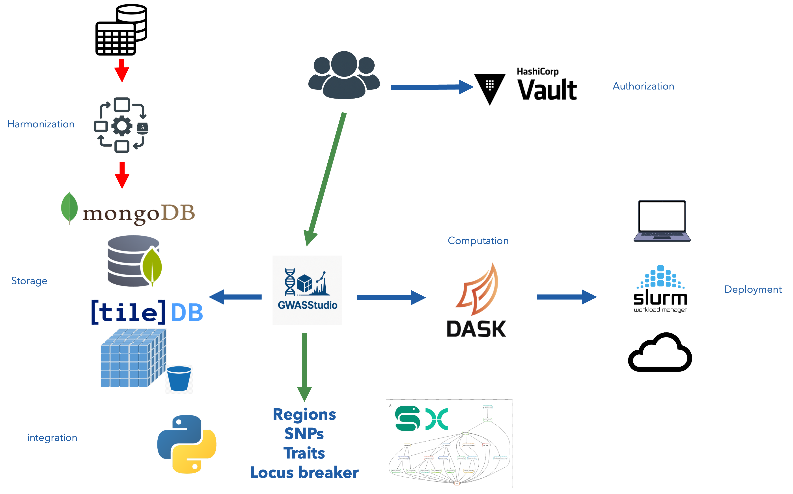

# Computational Data Hub in a box

## Overview

The Computational Data Hub (CDH) in a box is the containerized version of the high-performance storage and query infrastructure designed to facilitate Cross-Dataset Exploration of Genomics Summary Statistics. This system enables efficient storage and rapid querying of large-scale genomics data, such as genome-wide association studies (GWAS) and quantitative trait loci (QTL) data.

The primary purpose of the CDH infrastructure is to address key challenges in genomic data management:

1. **Data Volume Challenge**: Modern genomic studies generate massive datasets that require specialized storage solutions.
2. **Integration Problem**: Combining and comparing results across multiple studies is traditionally difficult.
3. **Accessibility Issue**: Many valuable genomic datasets are stored in incompatible formats or isolated repositories.

**Containerized Infrastructure**

This version of the CDH is containerized using Docker, making it easy to deploy and manage on various environments. The infrastructure consists of several containers:

* **TileDB**: A multi-dimensional array database for storing terabytes of harmonized genomics association studies.
* **Dask**: A parallel computing library for fast querying and processing of large datasets.
* **MongoDB**: A NoSQL database for managing metadata.
* **Vault**: A secrets management system for securely storing and retrieving sensitive data.
* **MinIO S3 Storage**: An object storage solution for scalable and durable storage of genomics files.

**Features**

* **High-Performance Storage**: Leverages TileDB to store terabytes of harmonized genomics association studies.
* **Rapid Querying**: Supports fast querying of large datasets using Dask.
* **Parallel Processing**: Accommodates any Python-based function for parallel processing using Dask.
* **Metadata Management**: Utilizes MongoDB to manage metadata database.
* **Secrets Management**: Uses HashiCorp Vault to securely store and retrieve sensitive data, such as API keys and encryption keys.
* **Object Storage**: Provides durable and scalable storage of genomics files using MinIO S3.

<div style="background:#fff; display:inline-block; padding:4px;">
  
</div>

**System Requirements**

* Docker
* Docker Compose
* GNU Make
* Mongosh (optional)

**Getting Started**

1. Clone the repository: `git clone https://github.com/ht-diva/cdh_in_a_box`
2. Start the containers: `make start`
3. Shutdown the containers: `make stop`
4. Shutdown and remove the containers: `make clean`

**Usage**

First, start the infrastructure containers with Docker Compose:
```shell
make start
```

Then get access to the CDH container command line:
```shell
docker run --rm -i -v ./data:/data -v ./results:/results --network cdh_in_a_box_internal_net ghcr.io/ht-diva/gwasstudio:6ff728 /bin/sh
```

From inside the container, you can run a query with `[gwasstudio](http://github.com/ht-diva/gwasstudio)` (CDH cli):
```shell
gwasstudio --stdout --vault-token root --vault-url http://vault:8200 --vault-path cdh meta-query --search-file /data/search_demo_data.yml --output-prefix /results/out
```

And export the query results::
```shell
gwasstudio --stdout --vault-token root --vault-url http://vault:8200 --vault-path cdh export --search-file /data/search_demo_data.yml --output-prefix /results/out --uri s3://tiledb/data
```

Other `gwasstudio` commands are summarized in the **Makefile**:
* `make meta-query` – Run a query using a search file against the metadata database.  
* `make export_full_stats` – Export the full summary statistics for a query.  
* `make export_regions` – Export genomic regions for a query.  
* `make export_snps` – Export a SNP list for a query.


Web interfaces for the components are available at:
   * Minio: http://localhost:9000
   * Vault: http://localhost:8200

The MongoDB shell can be accessed with:
   * Docker: `docker exec -it mongodb mongosh`

**Contributing**

We welcome contributions to the project! Please submit issues and pull requests via GitHub.

**Citation**

Example files are derived from:

The variant call format provides efficient and robust storage of GWAS summary statistics. Matthew Lyon, Shea J Andrews, Ben Elsworth, Tom R Gaunt, Gibran Hemani, Edoardo Marcora. bioRxiv 2020.05.29.115824; doi: https://doi.org/10.1101/2020.05.29.115824
